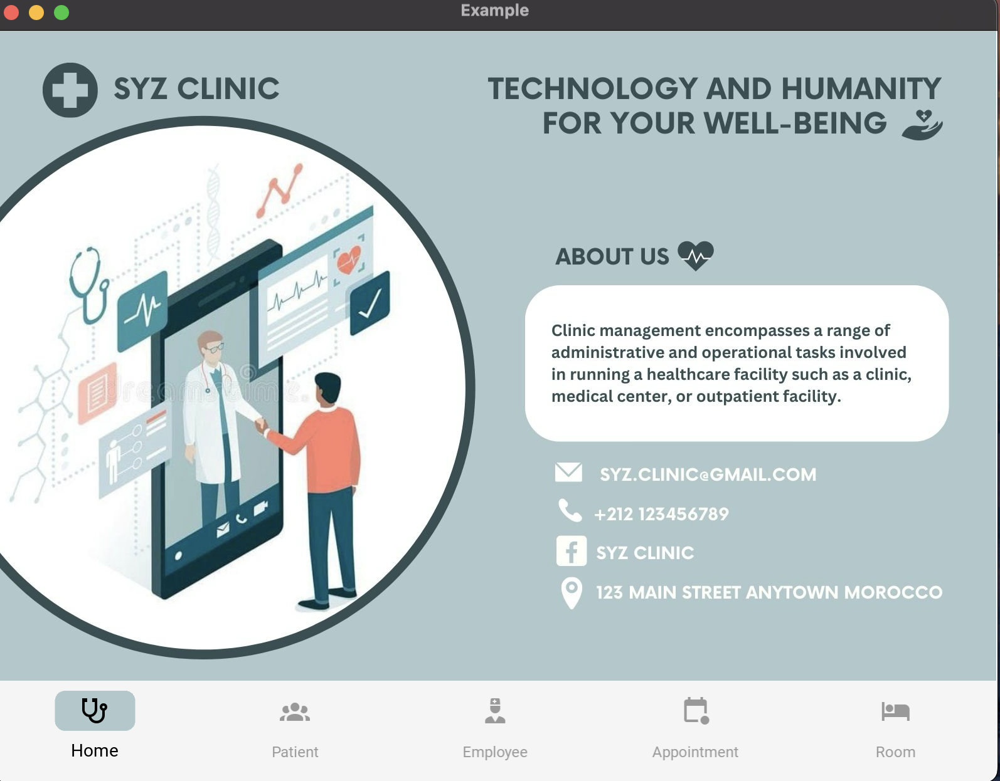
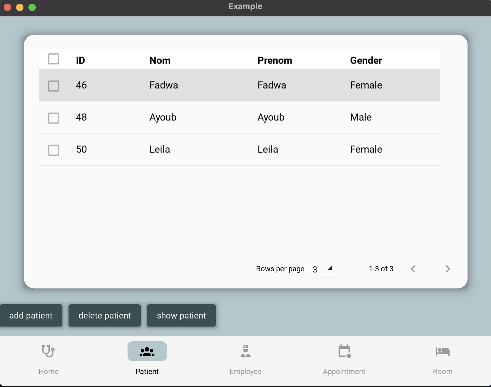
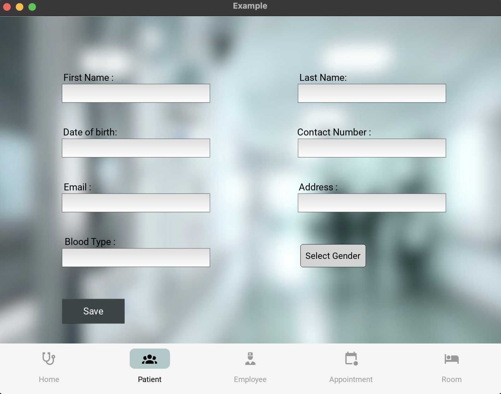
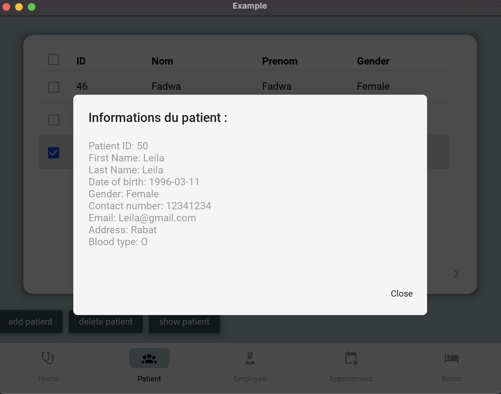
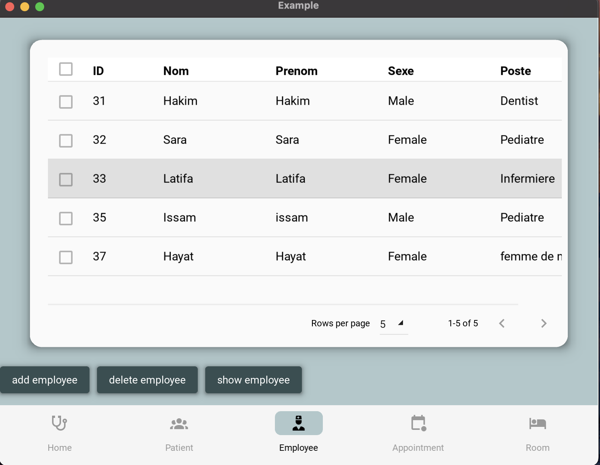
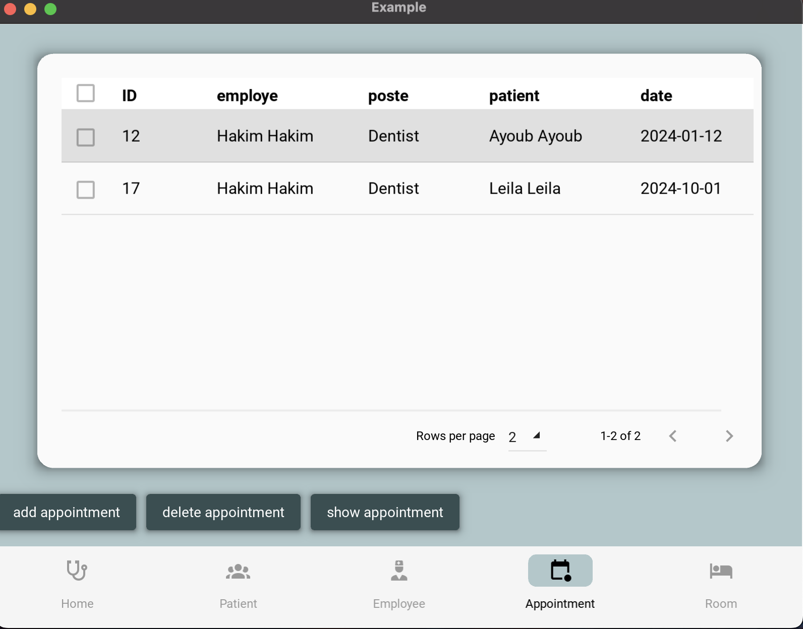
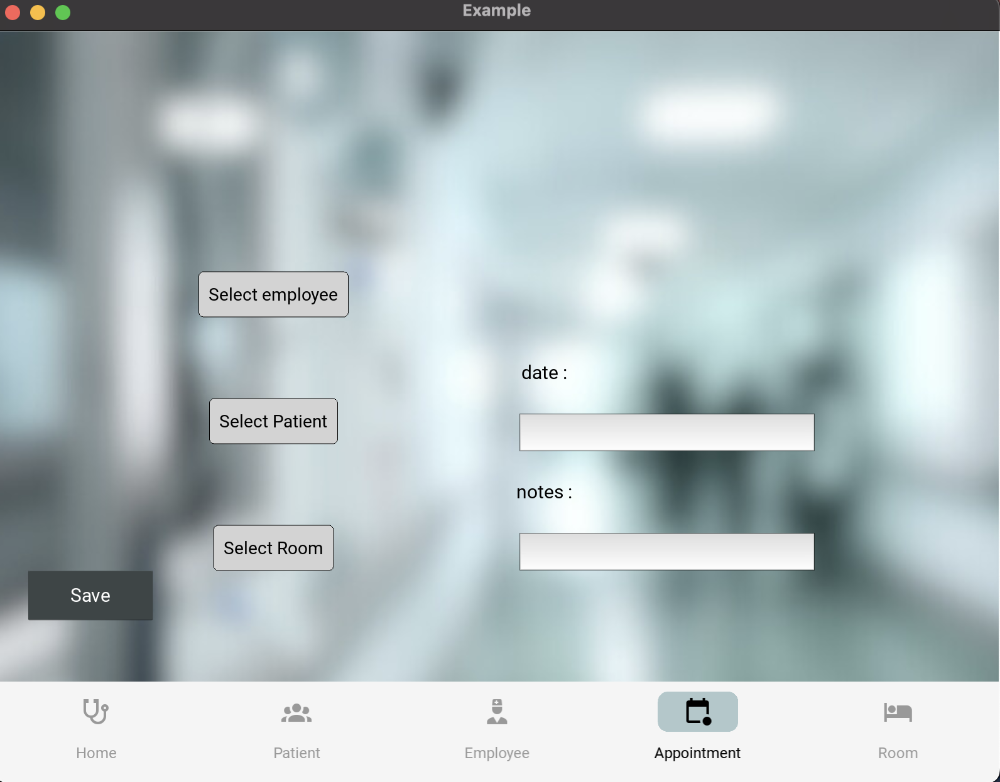
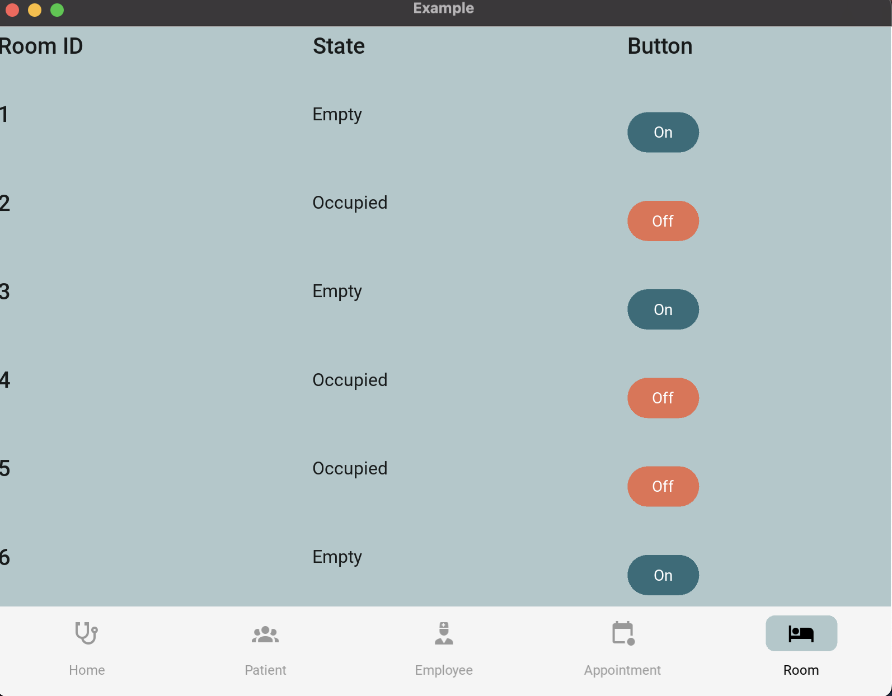

# Hospital Management App

## Description
The Clinic Management App is a locally deployable application written in Python using SQLAlchemy for database management and Kivy for the user interface. It is designed to streamline clinic operations, providing functionality for managing patients, employees, appointments, and room occupancy.

## Technologies Used
- **Python:** Backend development.
- **SQLAlchemy ORM (Object-Relational Mapping): **ORM.
- **Kivy&KivyMd:** User interface development.

## Prerequisites
Before running the Clinic Management App, ensure you have the following:
- Python installed on your machine.
- Access to a phpMyAdmin instance for managing the app's database.
- Basic understanding of Python programming and database concepts.

## Screens

### Home Screen
- Displays the clinic's menu and essential information.

### Patient Screen
- Enables users to add, view, and delete patient information.

- Provides a user-friendly interface for managing patient records.
    - Add Patient screen :

    - Show patient's informations :

### Employee Screen
- Allows users to add, view, and delete employee information.

- Provides similar functionality to the patient screen for managing employee records.

### Appointment Screen
- Enables users to schedule appointments by selecting a patient, employee, room, and date.

### Room Screen
- Provides functionality to view and manage the occupancy status of clinic rooms.
- Allows users to toggle room states between empty and occupied by clicking on the corresponding buttons.

## Installation
1. Clone the repository to your local machine: 
git clone git@github.com:ussra-ch/clinic.git
2. Navigate to the project directory: 
cd clinic
3. Start the application: 
python clinic2.py

## Version History
- **Version 1.0:**
- Initial release with basic functionality.
